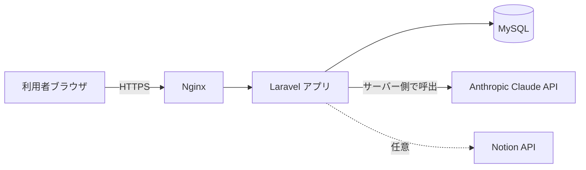
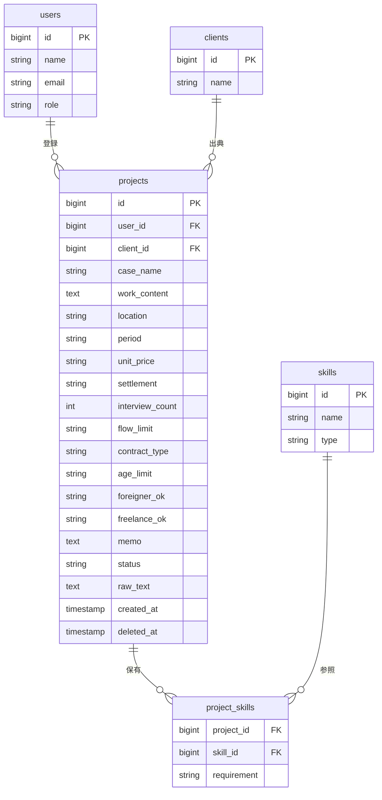
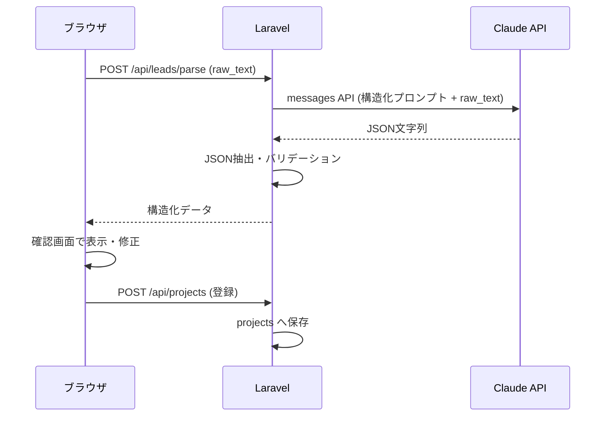
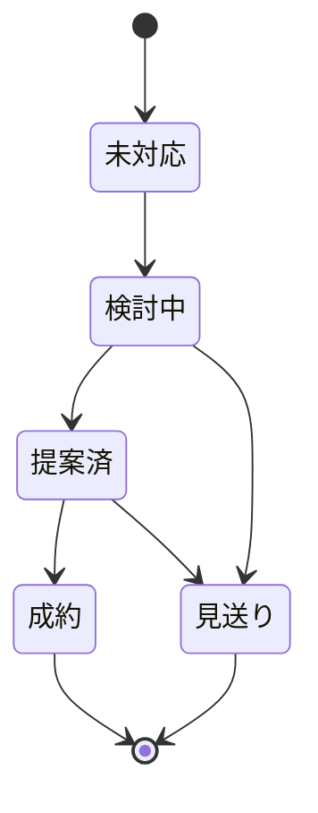

# SES案件情報管理システム 基本設計書

| 項目 | 内容 |
|---|---|
| ドキュメント名 | SES案件情報管理システム 基本設計書 |
| バージョン | 1.0 |
| 作成日 | 2026-06-12 |
| ステータス | ドラフト |

> **前提**: 本設計書は PHP 8.x / Laravel 11 / MySQL 8.x / JavaScript(SPA) / Linux を標準スタックとして記述しています。AI解析には Anthropic Claude API を利用します。スタックを変更する場合は「2. 技術スタック」および関連章を読み替えてください。

---

## 1. システム概要

### 1.1 目的

複数の取引先から個別のフォーマットで届くSES営業リード（案件情報）を一元的に取り込み、構造化・蓄積・検索・進捗管理するためのWebアプリケーションを構築する。テキストで届く非定型の案件情報をAIで自動構造化することで、転記作業と管理コストを削減し、案件対応の抜け漏れを防止する。

### 1.2 解決する課題

- 案件情報がメール・チャットに散在し、横断的に比較・検索できない
- フォーマットが取引先ごとに異なり、手作業での転記に時間がかかる
- 各案件の対応状況（提案中／成約等）が可視化されていない

### 1.3 利用者

| ロール | 説明 | 主な操作 |
|---|---|---|
| 営業担当 | リードの登録・進捗更新を行う一般ユーザー | 解析登録、ステータス更新、検索 |
| 管理者 | ユーザー管理・全案件の閲覧を行う | 全機能＋ユーザー管理、エクスポート |

### 1.4 用語定義

| 用語 | 定義 |
|---|---|
| リード | 取引先から受領した案件募集の元テキスト |
| 案件（Project） | リードを構造化して登録したレコード |
| ステータス | 案件の対応状況（未対応／検討中／提案済／成約／見送り） |
| 解析（Parse） | AIがリード本文から各項目を抽出する処理 |

---

## 2. 技術スタック

| 層 | 技術 | 補足 |
|---|---|---|
| 言語 | PHP 8.3 | バックエンド |
| フレームワーク | Laravel 11 | API＋認証 |
| DB | MySQL 8.0 | InnoDB / utf8mb4 |
| フロントエンド | JavaScript (Vue 3 もしくは Blade + Alpine.js) | SPA想定 |
| CSS | Tailwind CSS | |
| AI | Anthropic Claude API (claude-sonnet-4-6) | サーバー側から呼び出し |
| 認証 | Laravel Breeze / Sanctum | セッション or トークン |
| キュー | Laravel Queue (database / Redis) | AI解析の非同期化（任意） |
| Webサーバー | Nginx + PHP-FPM | Linux (Ubuntu) |

---

## 3. システム構成

### 3.1 アーキテクチャ



### 3.2 処理方式の方針

- **Claude APIはサーバー側から呼び出す。** APIキーをフロントに露出させず、Laravel のコントローラ／ジョブ経由で実行する。
- 解析は同期実行を基本とし、将来的にリード量が増えた場合はキュー（非同期）に切り替えられる構成とする。
- 外部API障害時もアプリ自体は停止しないよう、解析失敗時は手動入力にフォールバックできる画面設計とする。

---

## 4. 機能要件

### 4.1 機能一覧

| ID | 機能 | 概要 | 優先度 |
|---|---|---|---|
| F-01 | リード解析登録 | 貼り付けたテキストをAI解析し、確認後に案件として登録 | 高 |
| F-02 | 手動登録・編集 | 解析結果の修正、項目の手入力 | 高 |
| F-03 | 案件一覧表示 | 登録済み案件の一覧・カード表示 | 高 |
| F-04 | 検索・フィルタ | 案件名・スキル・場所での検索、ステータス絞り込み | 高 |
| F-05 | ステータス管理 | 対応状況の更新、パイプライン表示 | 高 |
| F-06 | 案件削除 | 不要な案件の削除（論理削除） | 中 |
| F-07 | エクスポート | CSV出力 | 中 |
| F-08 | ユーザー認証 | ログイン・ログアウト | 高 |
| F-09 | ユーザー管理 | 管理者によるユーザー追加・権限設定 | 中 |
| F-10 | Notion連携 | 案件をNotionデータベースへ同期 | 低（将来） |

### 4.2 機能詳細

#### F-01 リード解析登録

1. 利用者がリード本文をテキストエリアに貼り付け、「解析」を実行する。
2. サーバーが Claude API に構造化プロンプトを送信し、JSONで各項目を受け取る。
3. 解析結果を確認画面に表示する（この時点では未保存）。
4. 利用者が内容を確認・修正し「登録」すると、`projects` テーブルに保存する。
5. 解析に失敗した場合はエラーを表示し、空フォームでの手動登録に切り替えられる。

**解析対象項目**: 案件名、作業内容、必須スキル、尚可スキル、就業場所、就業期間、単価、精算幅、面談回数、商流制限、契約形態、年齢制限、外国籍可否、個人事業主可否、特記事項。

#### F-04 検索・フィルタ

- フリーワード検索: 案件名・作業内容・就業場所・スキルを対象（部分一致）
- ステータス絞り込み: 単一ステータスでのフィルタ
- ソート: 登録日（降順デフォルト）、単価

#### F-05 ステータス管理

- ステータス遷移は任意（強制フローは設けない）
- ボードビューでステータスごとにグループ表示し、ドラッグまたはセレクトで変更可能とする

---

## 5. 非機能要件

| 区分 | 要件 |
|---|---|
| 性能 | 一覧表示は1,000件規模でも2秒以内に応答。解析はAPI応答に依存（目安5〜15秒）。 |
| 可用性 | 外部API障害時もアプリの閲覧・手動登録は継続可能とする。 |
| セキュリティ | 認証必須。APIキーはサーバー環境変数で管理し露出させない。通信はHTTPS。 |
| 保守性 | 解析プロンプトを設定ファイル化し、コード変更なしで調整可能とする。 |
| 拡張性 | 取引先・担当者・対応履歴などのテーブル追加を見越した正規化設計とする。 |
| ログ | 解析リクエスト／レスポンスとエラーを記録する。 |

---

## 6. データモデル

### 6.1 ER図



### 6.2 テーブル定義

#### projects（案件）

| カラム | 型 | NULL | 説明 |
|---|---|---|---|
| id | BIGINT UNSIGNED | × | 主キー |
| user_id | BIGINT UNSIGNED | × | 登録者（users.id） |
| client_id | BIGINT UNSIGNED | ○ | 取引先（clients.id） |
| case_name | VARCHAR(255) | × | 案件名 |
| work_content | TEXT | ○ | 作業内容 |
| location | VARCHAR(255) | ○ | 就業場所 |
| period | VARCHAR(255) | ○ | 就業期間 |
| unit_price | VARCHAR(100) | ○ | 単価（記号を含むためテキスト） |
| settlement | VARCHAR(100) | ○ | 精算幅 |
| interview_count | TINYINT | ○ | 面談回数 |
| flow_limit | VARCHAR(100) | ○ | 商流制限 |
| contract_type | VARCHAR(50) | ○ | 契約形態 |
| age_limit | VARCHAR(50) | ○ | 年齢制限 |
| foreigner_ok | VARCHAR(20) | ○ | 外国籍可否 |
| freelance_ok | VARCHAR(20) | ○ | 個人事業主可否 |
| memo | TEXT | ○ | 特記事項 |
| status | VARCHAR(20) | × | ステータス（既定: 未対応） |
| raw_text | TEXT | ○ | 元リード本文（再解析・監査用） |
| created_at | TIMESTAMP | × | 登録日時 |
| updated_at | TIMESTAMP | × | 更新日時 |
| deleted_at | TIMESTAMP | ○ | 論理削除日時 |

#### skills / project_skills（スキル・中間テーブル）

スキルを正規化し、横断検索・タグ集計を可能にする。`project_skills.requirement` に `required`（必須）／`preferred`（尚可）を保持する。簡易実装ではスキルを `projects` 内のJSONカラムで持つ選択肢もあるが、検索性を重視し正規化を推奨する。

#### status の取り得る値

`未対応 / 検討中 / 提案済 / 成約 / 見送り`

---

## 7. API設計

すべて `/api` 配下、認証必須（Sanctum）。リクエスト／レスポンスはJSON。

| メソッド | パス | 説明 |
|---|---|---|
| POST | `/api/leads/parse` | リード本文を解析し構造化結果を返す（未保存） |
| GET | `/api/projects` | 案件一覧（検索・フィルタ・ページネーション） |
| POST | `/api/projects` | 案件を登録 |
| GET | `/api/projects/{id}` | 案件詳細 |
| PUT | `/api/projects/{id}` | 案件を更新 |
| PATCH | `/api/projects/{id}/status` | ステータスのみ更新 |
| DELETE | `/api/projects/{id}` | 案件を論理削除 |
| GET | `/api/projects/export` | CSVエクスポート |

### 7.1 POST /api/leads/parse

**リクエスト**
```json
{ "raw_text": "【案件名】：..." }
```

**レスポンス**
```json
{
  "case_name": "車載セキュリティエビデンス検証",
  "work_content": "設計部門成果物のレビュー...",
  "required_skills": ["AUTOSAR等の車載開発経験", "ISO/SAE 21434の理解"],
  "preferred_skills": ["セキュリティレビュー経験"],
  "location": "基本テレワーク または 門前仲町",
  "period": "2026年5月～(長期想定)",
  "unit_price": "～75万円",
  "settlement": "確認中",
  "interview_count": 2,
  "flow_limit": "貴社まで",
  "contract_type": "準委任契約",
  "age_limit": "不問",
  "foreigner_ok": "不可",
  "freelance_ok": "可",
  "memo": "成果物レビューが中心..."
}
```

---

## 8. AI解析処理設計

### 8.1 処理フロー



### 8.2 プロンプト方針

- システム的指示で「JSONオブジェクトのみを返し、コードフェンスや説明文を付けない」ことを明示する。
- 抽出フィールドと、情報がない場合は空文字／空配列を返す旨をスキーマで指定する。
- プロンプト本文は `config/lead_parser.php` 等に切り出し、コード変更なしで調整可能とする。

### 8.3 エラーハンドリング

| ケース | 対応 |
|---|---|
| APIタイムアウト・5xx | リトライ（最大2回）→ 失敗時は手動入力へフォールバック |
| JSONパース不可 | レスポンスから最初の`{`〜最後の`}`を抽出し再パース、不可なら失敗扱い |
| 必須項目（案件名）欠落 | 警告表示し、利用者に補完を促す |
| APIキー不正 | 500を返さず、設定エラーとしてログ記録・管理者通知 |

### 8.4 コスト・運用上の留意点

- 解析はトークン課金が発生するため、同一テキストの重複解析を避ける（`raw_text` のハッシュで判定）。
- 解析回数・トークン量をログに残し、月次でコストを把握できるようにする。

---

## 9. 画面設計

| 画面ID | 画面名 | 主な要素 |
|---|---|---|
| S-01 | ログイン | メール／パスワード |
| S-02 | リード追加 | テキストエリア、解析ボタン、確認カード、登録／破棄 |
| S-03 | 案件一覧 | 検索ボックス、ステータスフィルタ、カード／テーブル、CSV出力 |
| S-04 | 案件詳細・編集 | 全項目フォーム、ステータス変更、削除 |
| S-05 | ボード | ステータス別カラムのカンバン表示 |
| S-06 | ユーザー管理（管理者） | ユーザー一覧、権限設定 |

画面遷移の基本は「ログイン → 案件一覧（ホーム）」とし、一覧からリード追加・詳細編集・ボードへ遷移する。

---

## 10. セキュリティ設計

- 全画面・APIで認証を必須とする（未認証はログインへリダイレクト）。
- Claude API キー・DB認証情報は `.env` で管理し、リポジトリに含めない。
- 入力値はサーバー側でバリデーション・サニタイズし、XSS／SQLインジェクションを防止する（Eloquent利用、Blade自動エスケープ）。
- CSRFトークンを有効化する。
- 取引先名・単価など営業上の機微情報を含むため、ロールに応じた閲覧制御を検討する。
- 監査用に登録・更新・削除の操作ログを残す。

---

## 11. ディレクトリ構成（抜粋）

```
app/
├── Http/
│   ├── Controllers/
│   │   ├── LeadParseController.php   # F-01 解析
│   │   └── ProjectController.php     # F-03〜F-07
│   └── Requests/
│       └── StoreProjectRequest.php   # バリデーション
├── Services/
│   ├── LeadParserService.php         # Claude API 呼び出し・JSON整形
│   └── NotionSyncService.php         # F-10（将来）
├── Models/
│   ├── Project.php
│   ├── Skill.php
│   └── Client.php
config/
└── lead_parser.php                   # 解析プロンプト・モデル設定
resources/
└── js/ or views/                     # フロントエンド
database/
└── migrations/
```

---

## 12. 開発・テスト・デプロイ

### 12.1 開発フェーズ

| フェーズ | 内容 |
|---|---|
| 1 | DB設計・マイグレーション、認証 |
| 2 | F-01 解析登録（Claude連携）、F-02 手動登録 |
| 3 | F-03〜F-05 一覧・検索・ステータス |
| 4 | F-06 削除、F-07 エクスポート |
| 5 | F-09 ユーザー管理、テスト・調整 |
| 6（将来） | F-10 Notion連携 |

### 12.2 テスト方針

- 単体テスト: `LeadParserService` のJSON整形・異常系（PHPUnit、Claude API はモック）
- 機能テスト: 各APIエンドポイントのFeatureテスト
- 結合テスト: 実際のリードサンプルでの解析精度確認（取引先別フォーマットを複数用意）

### 12.3 デプロイ

- Nginx + PHP-FPM、`.env` 設定、`php artisan migrate --force`、ビルド（npm run build）。
- 解析失敗・APIコスト監視のためのログ集約を設定する。

---

## 13. 将来拡張

- **F-10 Notion連携**: `NotionSyncService` から Notion API で案件をデータベースへ同期。NotionのAPIはサーバー側から呼ぶ（CORS制約のためフロント直叩きは不可）。
- **メール自動取込**: 受信メールをWebhook／IMAPで取り込み、自動解析してドラフト登録。
- **取引先・対応履歴管理**: `clients`・対応履歴テーブルを拡張し、商流や提案履歴を追跡。
- **マッチング**: 登録技術者のスキルと案件要件の自動マッチング。

---

## 付録A: ステータス遷移（参考）


